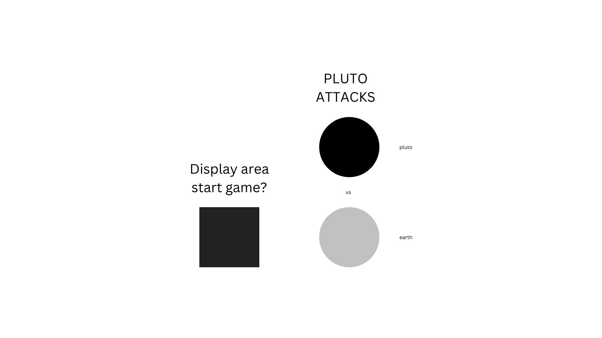
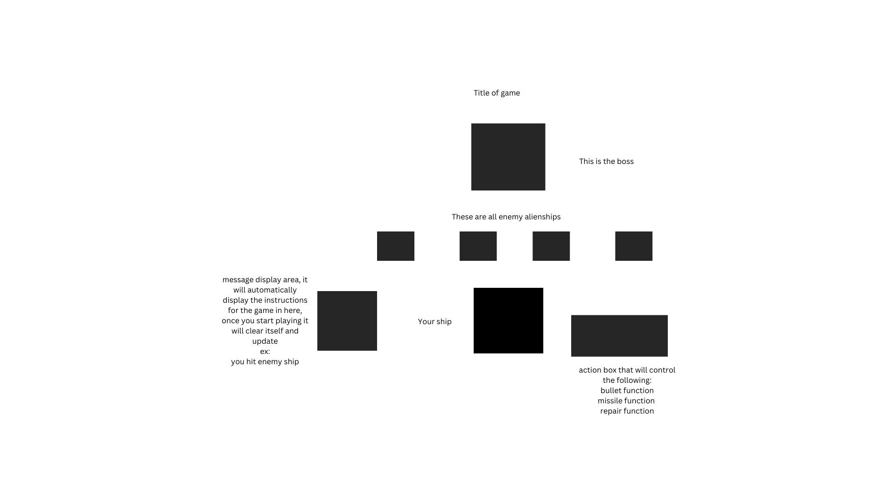
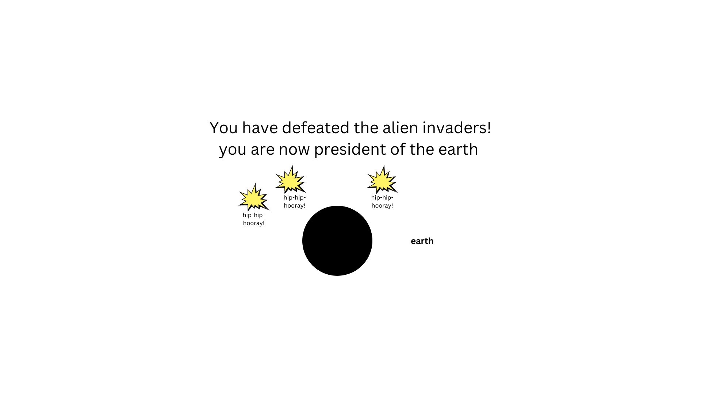
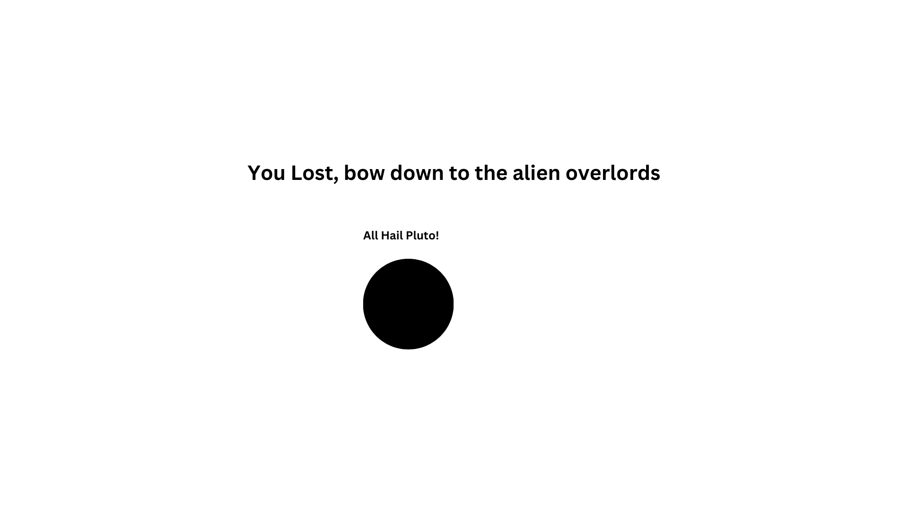

## PLUTO ATTACKS

startscreen: 
gameboard: 
you-won-message: 
you-lost:

## Link to the game
https://parvezjhim.github.io/project-1/

## Story time

You are a captain of the Space Force and are bored out of your mind while speaking to a solider:

Captain: “Man why did I become a captain for the space force, we haven’t fought ANY aliens yet! Should’ve joined the damn Nav….

*SUDDEN EXPLOSION”

*GROUND SHAKES*

*YOU HEAR WHAT SOUNDS LIKE THE VOICE OF GOD”

ATTENTION ALL HUMANS, SEVERAL YEARS AGO YOU DECLASSIFIED OUR BEAUTIFUL HOME AS A PLANET! WE PLUTONIANS TOOK THIS TO HEART AND HAVE BEEN PLANNING AN ACT OF WAR OF VERY LONG! LET’S SEE IF EARTH IS STILL CLASSIFIED AS A PLANET AFTER WE ARE DONE WITH IT!

Captain:”Well shit, here we gooo!”

Your goal as the captain of the space force is to defend Earth from the plutonian invaders. You will have to fight through their 5 enemy ships to get to the big boss ship and defeat it. You have bullets/lasers that you can use to fire at your enemies.

You will battle each ship one at a time, and progress to the next one as you defeat them. If you are destroyed all hope for the planet is lost and the plutonians will be our new alien overlords.

## MVP 
- Render a start screen 
- Display instructions in the message display area 
- Use DOM manipulation to target the alien ships to remove them when they are destroyed and do the same for my ship if i am destroyed
- The ship will have a laser fire function that allows you to attack the aliens 
- You can use the fire function at anytime
- When the ship fires there should be a little flame that appear and disappears in front of the ship
- When you defeat all enemy ships you will face a boss that does more damage and has more health 
- If you win you will get a message that appears in the message display area that says you have the saved the earth and are not president of the earth
- move enemies and player with canvas using a setInterval
- use canvas to create the game, do enemy and player movement 
- use canvas to figure out bullets 

## ROADBLOCKS
- i believe i may have some roadblocks when it comes to 
- displaying messages when an action is taken
- i'm not sure if i should create an array with several different messages to display for each action or just KISS and leave it to one
- rendering screen stuff is still a little confusing 

## Stretch Goals
- Add in my own assets to the game 
- Have a random number of enemies of spawn 
- The enemies will have randomized stats
- Allow for power ups in between rounds 
- Create difficulty mode

## super stretch goals 
- i would like to make this an auto battler game where you choose 3 ships to begin with 
- those ships will have different health and attack stats and have various effects as well 
    ex: upon destruction of ship activate self destruct feature which will cause 5 damage to all surrounding units 
as you progress through the rounds you have the option to level up curernt ships, add new ships to your squadron or swap out ships
- i would like the game to have an enddless mode 
- i wouuld like the game to have a PvP mode 

